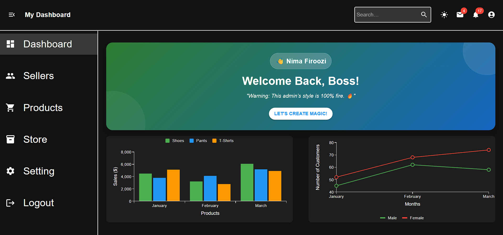
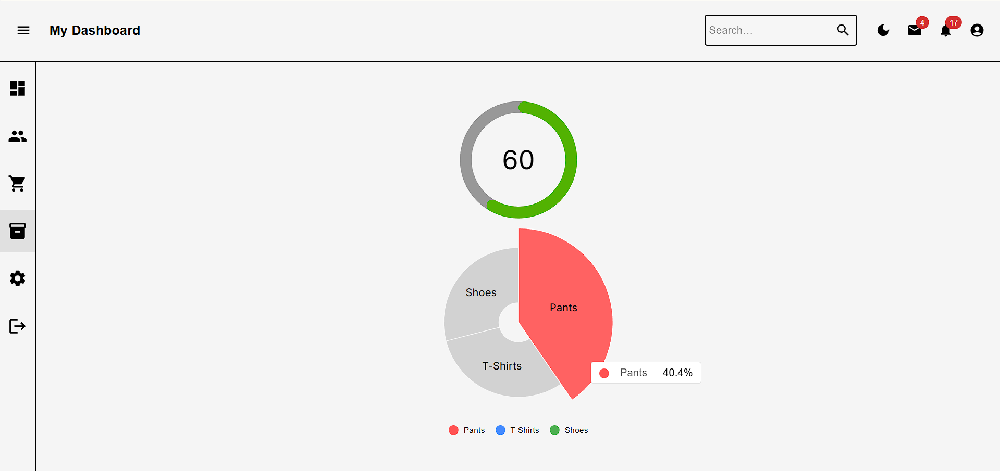
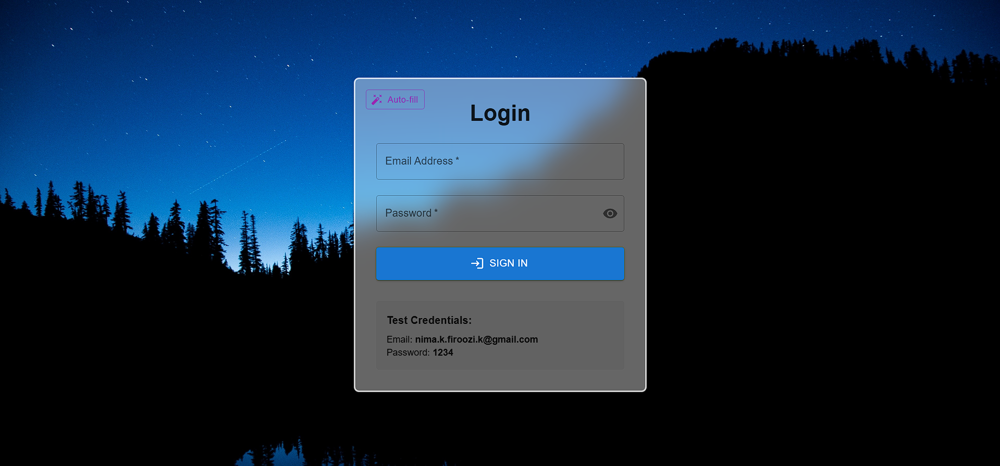

# Admin-panel

  
  
  
  
  
  

#
🚀 About This Project
This admin panel is a Single Page Application (SPA) built with React, Next.js, and Material-UI (MUI). It showcases modern frontend development practices, including:

Full Responsiveness (Mobile, Tablet, Desktop)

Dynamic Routing (Next.js)

MUI Components & Theming

State Management (Context API)

LIGHT & DARK

🔍 Goal: Demonstrate my skills in building scalable, user-friendly interfaces.
💡 Feedback Welcome! I’d love to hear your thoughts. Thanks for checking it out!
- Role - Frontend

# ONLINE DEMO

# Technologies Used:
 React , Next.Js , MUI , SPA
 # SCREEN-SHOT

